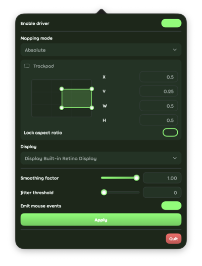

rizkia fork to tokaa1/trackpaddy. changes i made:
- uncomment emit mouse event
- bump to macos 27
- default settings:
  - mapping mode: absolute
  - region: x 0.5, y 0.25, w 0.5, h 0.5
  - smoothing factor: 1.00
  - jitter threshold: 0
  - emit mouse events: yes

[download in releases](https://github.com/Rizkiacry/trackpaddy/releases) (zip), drag and drop to /applications

thanks to:
- lokxii for c driver
- tokaa1 for ui, features, and fixes
